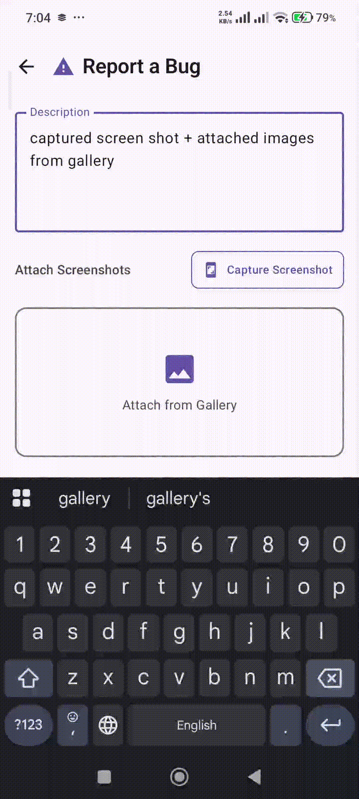
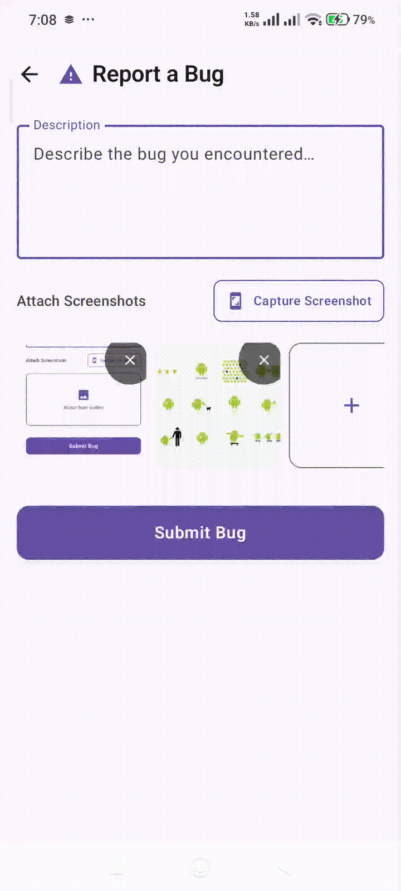
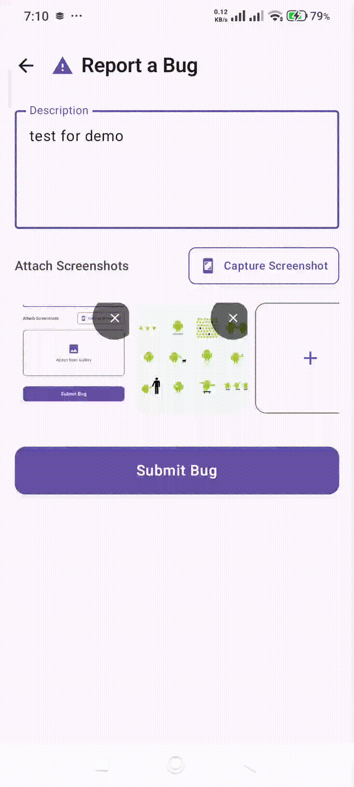
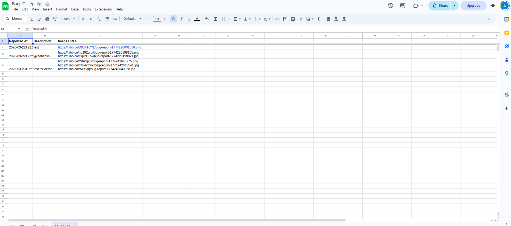
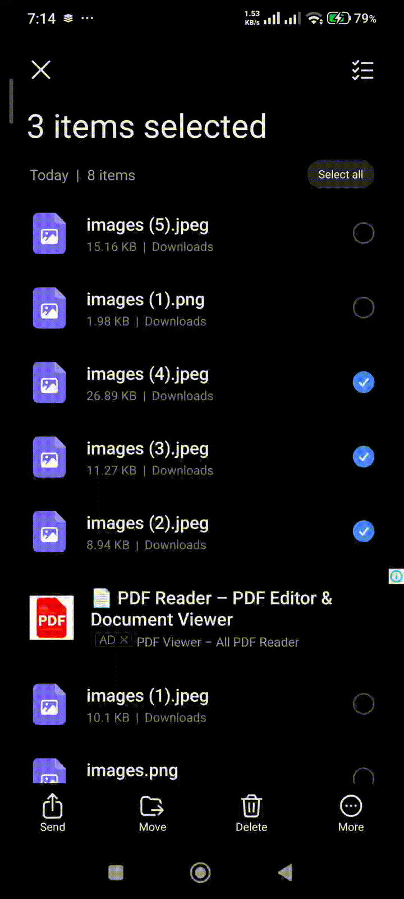
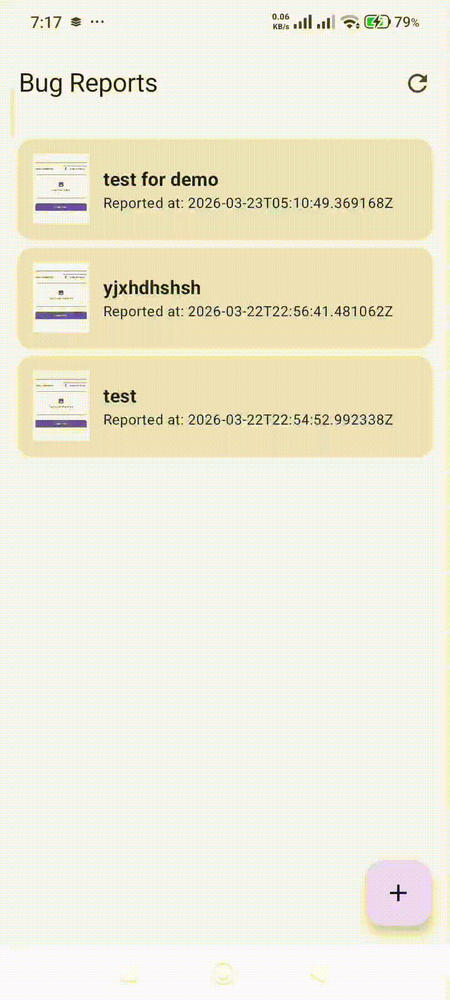

# Bug-IT 🐞

Bug-IT is a lightweight Android utility designed to streamline bug reporting.
It captures bug descriptions and screenshots, uploads images to a 3rd-party service, and logs everything into a centralized Google Sheet using Apps Scripts.

## 🚀 Key Features

### 1. Multi-Source Image Attachment
- **Gallery & Screenshot**: Users can select images from their device's gallery or capture a screenshot directly within the app using the `PixelCopy` API for high-quality screenshot capturing.
- **Multiple Images**: Capability of attaching multiple screenshots to a single bug report.
- **Image Management**: Easily remove incorrectly attached images before submission.

> **Visual Guide**: 
> *Placeholder: [IMAGE_SELECTION_GIF]*

### 2. Mandatory Description & Validation
- Ensures data integrity by requiring a mandatory description before submission.
- Real-time UI feedback for validation errors.

> **Visual Guide**: 
> *Placeholder: [VALIDATION_GIF]*

### 3. 3rd-Party Image Hosting (ImgBB)
To keep the Google Sheet lightweight and accessible:
- **Upload**: Images are sent to [ImgBB](https://imgbb.com/) via their REST API.
- **Attachment**: The API returns direct permanent URLs (e.g., `https://i.ibb.co/...`).
- **Storage**: These URLs are stored as text links in the "Image URLs" column of the sheet.

> **Visual Guide**: 
> **Visual Guide**: 
> *Placeholder: [IMGBB_UPLOAD_SCREENSHOT]*

### 4. Daily Google Sheet Tabs
Bug data is organized efficiently in Google Sheets:
- **Dynamic Tabs**: The system automatically creates or selects a tab based on the current date (e.g., `26-09-23`, `27-09-23`).
- **Data Persistence**: Logs "Reported At", "Description", and a list of "Image URLs".

> **Visual Guide**: 
> *Placeholder: [SHEET_TABS_SCREENSHOT]*

### 5. External Intent Integration (Receive Images)
Initiate a bug report immediately by sharing images from other apps (File Manager, Gallery, Photos, etc.).
- **Direct Landing**: Sharing an image lands the user directly on the bug creation screen, bypassing the list.
- **Support**: Handles both `ACTION_SEND` (single) and `ACTION_SEND_MULTIPLE` intents.

> **Visual Guide**: 
> *Placeholder: [INTENT_SHARING_GIF]*

### 6. Bug Reports List & Details
- **Unified List**: An initial screen displays a scrollable list of all submitted bugs, fetched from the Google Sheet.
- **Detail View**: Click on any bug to see its full description, a gallery of attached images, and the exact reporting time.
- **Automatic Refresh**: The list automatically refreshes after a new submission to show the latest entry at the top.

> **Visual Guide**: 
> *Placeholder: [BUG_DETAILS_GIF]*

---

## 🛠️ Setup Instructions

### 1. ImgBB API Key
1. Get a free API key from [api.imgbb.com](https://api.imgbb.com/).
2. Add it to your `gradle.properties`:
   ```properties
   IMGBB_API_KEY=YOUR_IMGBB_API_KEY_HERE
   ```

### 2. Google Apps Script Deployment
1. Create a new Google Sheet.
2. Go to **Extensions > Apps Script**.
3. Paste the code from `docs/apps-script/UploadITAppsScript.gs`.
4. Click **Deploy > New Deployment**.
5. Select **Web App**, set access to **Anyone**, and click **Deploy**.
6. Copy the Web App URL and add it to your `gradle.properties`:
   ```properties
   BUG_UPLOAD_ENDPOINT=https://script.google.com/macros/s/.../exec
   ```

---

## 🏗️ Architecture Note
The app follows modern Android practices:
- **Jetpack Compose** for a declarative UI.
- **Coil 3** for asynchronous image loading and network fetching.
- **Retrofit** for REST API communication.
- **State Hoisting** & **ViewModel** (AndroidViewModel) for robust state management.
- **Coroutines** for asynchronous operations, ensuring a responsive UI.
- **Material Design 3** for a sleek and intuitive user interface.
- **External Intents** for seamless integration with other apps.
- **Dynamic Google Sheet Tabs** for organized data management.
- **Comprehensive Error Handling** to ensure a smooth user experience even in failure scenarios.
- **MVVM Architecture** for a clean separation of concerns and maintainable codebase.
